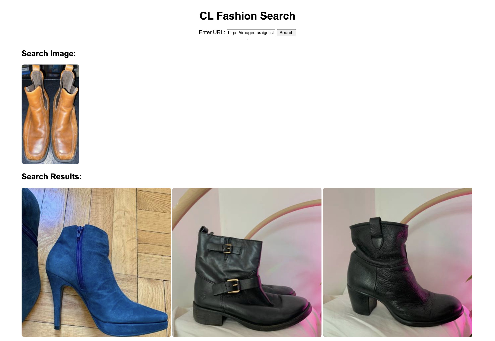

# fashion-search
DINOv2 based image search on Craigs List (clothes&amp;acc)

- Data collection code is in `collect-data.py`
- Image search code is in `fashion-search.ipynb`
- A small Flask server code is in `fashion-search.py`

## Screenshot

## Acknowledgements
Thanks to Roboflow for releasing a tutorial on how to do vector search using DINOv2. 

[roboflow/notebooks](https://github.com/roboflow/notebooks/blob/main/notebooks/dinov2-image-retrieval.ipynb)